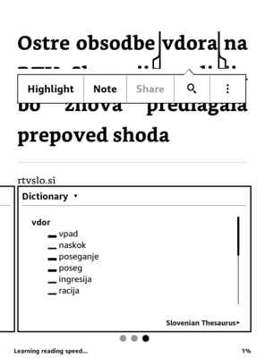
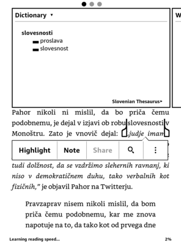
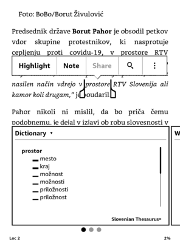
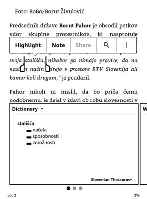

# Slovenian thesaurus importer

This project serves for:

* Building a Slovenian thesaurus for Kindle devices
* Building a database for the [Slovenian thesaurus mobile app](https://github.com/tkrajina/slo-dictionary-app)

## Slovenian Thesaurus for Kindle

The Slovenian Thesaurus for Kindle is available [here](https://github.com/tkrajina/slo-dictionary-importer/releases). Download the file `slo-thesaurus.mobi` and transfer to your Kindle (under `documents/`).

When reading a document in Slovenian:
* mark a word
* in the popup-window find "Dictionary"
* at the bottom click "Select New Dictionary"
* select "Slovenian thesaurus"

Now long-pressing words in that document will open the Slovenian Thesaurus dictionary and open the appropriate entry (see screenshots).

Every entry includes:
* a list of synonymis
* a list of examples (for most words)
* word frequency (for the more popular words)

The selected word doesn't have to be in normal form. For example marking "šola", "šole" (plural) and "šolama" (dative case) will find the correct lemma form ("šola").

The Thesaurus is compiled using the following datasets:
* [Thesaurus of Modern Slovene 1.0](https://www.clarin.si/repository/xmlui/handle/11356/1166)
* [Collocations Dictionary of Modern Slovene KSSS 1.0](https://www.clarin.si/repository/xmlui/handle/11356/1250)
* [Morphological lexicon Sloleks 2.0 - Clarin-SI](https://www.clarin.si/repository/xmlui/handle/11356/1230)
* [Frequency lists of words from the GOS 1.0 corpus 1.1](https://www.clarin.si/repository/xmlui/handle/11356/1364)

(All released under CC licenses).

### Screenshots:

## Slovenian thesaurus mobile app

See more [here](https://github.com/tkrajina/slo-dictionary-app).

Download the app:

* For iOS: <https://apps.apple.com/us/app/slovene-thesaurus/id1544614699>
* For Android: <https://play.google.com/store/apps/details?id=hr.scio.slo>

## Running the project

Download the datasets locally:

	make download

Build the database for the mobile app:

	make build-db

Build the kindle dictionary:

	make kindle-dict
	make kindlegen

The last command assumes you have the "Kindle previewer" app installed.

## License

This project is licensed under the Apache License, Version 2.0.